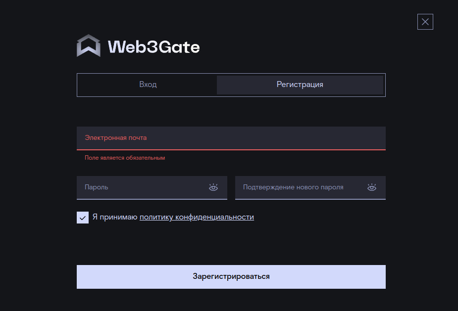
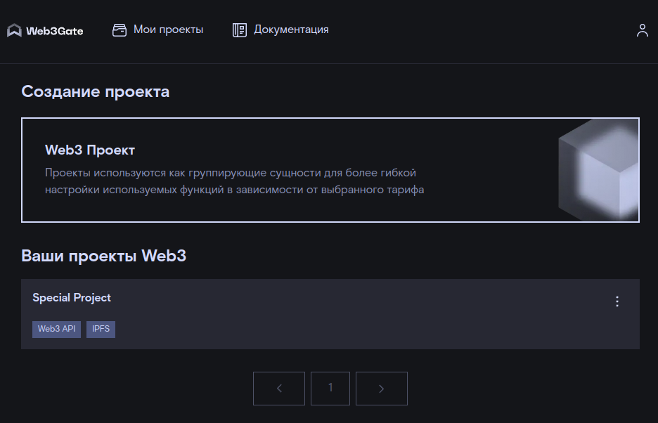
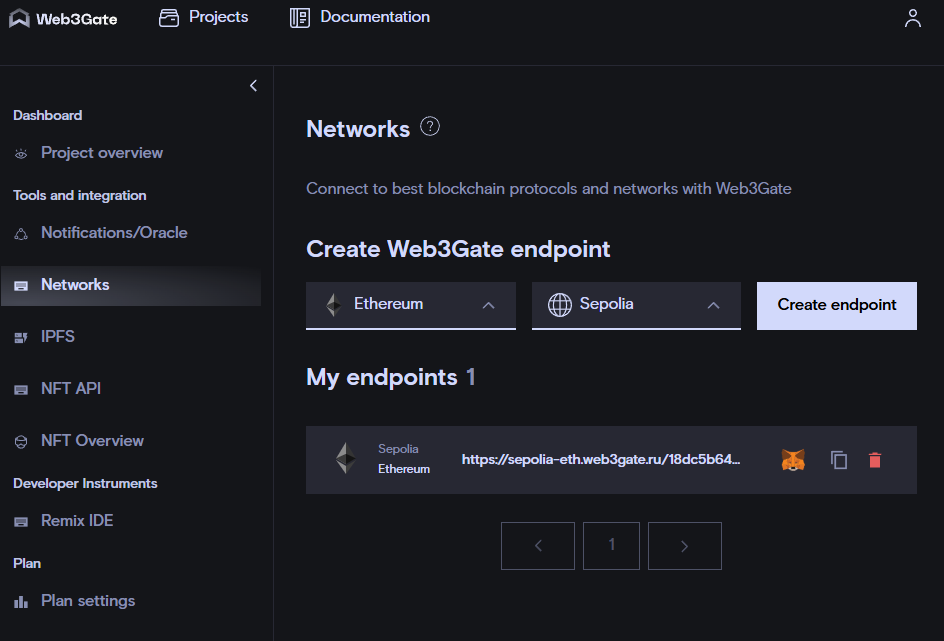

# Ethers tutorial - Block Explorer

Проект посвящен основам работы с провайдером web3gate и библиотекой `ethers.js`. 
Эти инструменты могут быть полезны, если вы захотите интегрировать операции с криптовалютой на сайте вашей компании. 
Пусть сегодня не во всех странах можно напрямую продавать или покупать товары и услуги за криптовалюту. 
Тем не менее, существуют косвенные схемы оплаты, а также надежда на скорые изменения в законодательстве. 
Как бы то ни было, расширение способов оплаты повысит конверсию и удобство для пользователей.  

Итак, сегодня мы разработаем собственный обозреватель блоков сети Ethereum и интерфейс для взаимодействия со смарт контрактами. 
В качестве IDE используем VSCode, среда исполнения - node.js, библиотека UI - React 18. 
Точку доступа к тестовой сети Ethereum sepolia предоставляет провайдер web3gate компании Rostelecom.  

План занятия: 
1. Создать точку доступа и протестировать с помощью простого вызова js кода. 
2. Создать react-приложение обозреватель блоков сети ethereum. 
3. Добавить функционал взаимодействия со смарт-контрактами, размещенными в сети. 

Стартовый код включает в себя эту инструкцию и определение стилей в файле `App.css`.  

## 1. Создание точки доступа Web3Gate endpoint 

Зарегистрируйтесь на портале www.web3gate.ru 



Введите свой почтовый адрес, придумайте пароль и примите политику конфиденциальности.  

Создайте новый Web3 Проект.  



Создайте точку доступа к сети Ethereum - Sepolia  



Инициализируйте проект Node и установите библиотеку axios для выполнения тестового запроса.  

```sh
npm init --yes 
npm install axios
```


Создайте файл index.js и наполните его содержимое 

```js
const axios = require("axios");

const url = `https://sepolia-eth.web3gate.ru/{api_key}`;

const payload = {
  jsonrpc: '2.0',
  id: 1,
  method: 'eth_blockNumber',
  params: []
};

axios.post(url, payload)
  .then(response => {
    console.log('The latest block number is', parseInt(response.data.result, 16));
  })
  .catch(error => {
    console.error(error);
  });
```

 Выполните запрос командой 

 ```sh
 node .\index.js
 ```
 В консоли должно появиться сообщение (номер блока может быть больше):
```
The latest block number is 7115753
```
Если запрос прошел успешно, перейдем к созданию приложения с пользовательским интерфейсом. 

## 2. Создание react-приложения 

Для фронтенда традиционно используется библиотека `React` на платформе node.js. 
Актуальная версия реакта - 18.3.  

Создайте новое приложение с помощью vite и перейдите в рабочий каталог:  
```sh
npm create vite@latest dapp -- --template react
cd dapp
```
 
В файле `package.json`  в раздел `dependencies` добавьте зависимость `"ethers": "6.13"` 

Установите зависимости и запустите приложение
```
npm install
npm run dev
``` 
Перейдите по ссылке `http://localhost:5173/`. 
Если  localhost блокируется по протоколу http, нужно отключить правило безопасности для локальной разработки. 
Рассмотрим пример с браузером Chrome.  
Откройте новую вкладку с адресом `chrome://net-internals/#hsts`.   
В разделе `Delete domain security policies` введите `localhost` и нажмите кнопку `Delete`.  
После этого закройте и снова откройте вкладку `http://localhost:5173/`, должно заработать. 

И наконец, настройте стили приложения. 
Для этого в папке src замените содержимое файла App.css на то, что лежит в корне проекта и очистите содержимое файла index.css.
  
### 2.1. Настройка провайдера
Библиотека `ethers` - это компактный и функциональный инструмент для взаимодействия с блокчейном ethereum. 
Класс `Provider` является базовой абстракцией для чтения информации о состоянии аккаунтов, событий и запуска публичных идемпотентных методов смарт-контрактов. 


Замените содержимое файла `src/App.jsx`
```js
import { ethers } from "ethers";
import './App.css'

const providerUrl = 'https://sepolia-eth.web3gate.ru/api_key';

const provider = new ethers.JsonRpcProvider(providerUrl);
const network = await provider.getNetwork();
  
function App() {
  console.log(network);
  return (
    <>
    </>
  )
}

export default App
```

В окне браузера откройте панель разработчика (клавиша F12), в консоли должен появиться объект 
```js
_Network {
chainId: 11155111n
name: "sepolia"
}

```

Перепишем функцию App с использованием хуков React useState и useEffect: 
```js
import { ethers } from "ethers";
import './App.css'
import { useEffect, useState } from "react";


function App() {
  const [networkId, setNetworkId] = useState(0);
  const providerUrl = 'https://sepolia-eth.web3gate.ru/api-key';
  const provider = new ethers.JsonRpcProvider(providerUrl);
  
  useEffect(()=>{
    async function fetchNetId(){
      const network = await provider.getNetwork();
      console.log(network.chainId);
      setNetworkId(parseInt(network.chainId));
    }
    fetchNetId();
  })

  return (
    <>
    <h1>Hello, Dapp!</h1>
    <p>Network ID: {networkId}</p>
    </>
  )
}

export default App

```
  
### 2.2. Добавьте функцию BalanceReader 

В качестве основы используем компонент `Wallet` из предыдущего проекта `ecdsa-node`. 

В папке src добавьте BalanceReader.jsx со следующим содержимым:

```jsx 
import { ethers } from "ethers";
import { useState } from 'react';

function BalanceReader({ provider }) {
  const [address, setAddress] = useState("");
  const [balance, setBalance] = useState(0);

  async function onChange(evt) {
    const address = evt.target.value;
    console.log("address: ", address);
    setAddress(address);
    try {
      const balance = await provider.getBalance(address);
      console.log("balance: ", balance);
      const newBalance = ethers.formatEther(balance);
      setBalance(newBalance);
    } catch(err){
      console.log(err);
    }
  }

  return (
    <div className="container wallet">
      <h1>Balance Reader</h1>
      <label>
        Address: 
        <input placeholder="Type any address" value={address} onChange={onChange}></input>
      </label>
      <div className="balance">Balance: {balance} ETH</div>
    </div>
  );
}

export default BalanceReader;
```  

Подключите компонент BalanceReader в приложении App.jsx  

Проверьте состояние баланса, например аккаунта '0xeE2d4c1EF974a67E16caD4B19F209697694B4010'. 

### 2.3. Добавьте функцию обозревателя блоков 

 Библиотека `ethers.js` через класс `Provider ` позволяет читать состояние сети Ethereum, а именно:
* количество блоков в блокчейне
* содержимое транзакций в блоке
* аккаунты отправителя, получателя и количество монет в транзакции
* и многое другое. 

Существует множество готовых обозревателей блоков. 
Наиболее популярный обозреватель блоков сети Ethereum - [Etherscan](https://etherscan.io/). 
Проверьте как он работает, это поможет при самостоятельной реализации функций собственного обозревателя блоков. 

Мы разработаем компонент `BlockExplorer.jsx`, который позволит: 
- Вывести список из 3 последних блоков. 
- По клику на блоке вывести его содержимое - хеш текущего и предыдущего блока. 

Создайте компонент `Block.jsx` и наполните его содержимое: 

```js
import React, { useState, useEffect } from 'react';

function Block({blocknum, provider}) {
    const [open, setOpen] = useState(false);
    const [block, setBlock] = useState();

    function toggle(){ setOpen(!open); }

    useEffect(() => {
        async function getBlock() {
          const blockInfo = await provider.getBlock(blocknum);
          console.log(blockInfo);
          setBlock(blockInfo);
        }
        if (!block){ getBlock(); }
      }
    );

    return (
        <div>
            <hr/>
            <button onClick={toggle}>Block # {blocknum}</button>
            {open && 
            <div>
                <p>Block hash: {block.hash}</p>
                <p>Parent hash: {block.parentHash} </p>
            </div>}
        
        </div>
    )
}

export default Block; 
```

Вы можете добавить любую информацию о блоке, которая доступна через методы класса [Block](https://docs.ethers.org/v6/api/providers/#Block).  

Номер последнего текущего блока берется из сети через вызов метода `provider.getBlockNumber()`. 
Добавьте компонент `BlockExplorer.jsx` со следующим содержимым: 
```js
import { useState, useEffect } from "react";
import Block from "./Block";

function BlockExplorer({provider}) {
    const [blockNumber, setBlockNumber] = useState(0);
    
    useEffect(() => {
        async function getBlockNumber() {
          const latestBlockNum = await provider.getBlockNumber();
          console.log("latest block: ", latestBlockNum);
          setBlockNumber(latestBlockNum);
        }
        getBlockNumber();
      }
    );
    return (
        <div className="container">
            <h1>Block Explorer</h1>
            <Block 
                blocknum = {blockNumber}
                provider = {provider}
            />
            <Block
                blocknum = {blockNumber - 1}
                provider = {provider}
            />
            <Block
                blocknum = {blockNumber - 2}
                provider = {provider}
            />
        </div>
    )
}

export default BlockExplorer;
```

Подключите компонент `BlockExplorer` в приложении `App.jsx`.  


## 3. Взаимодействие со смарт-контрактами, размещенными в сети 

Класс `Contract` библиотеки `ethers.js` позволяет взаимодействовать со смарт-контрактами, размещенными в сети Ethereum. 
Список верифицированных смарт-контрактов можно найти в обозревателе [sepolia.etherscan](https://sepolia.etherscan.io/contractsVerified)
Взаимодействие со смарт-контрактом идет через бинарный интерфейс (ABI, application binary interface). 
Библиотека ethers преобразует вызов js-методов в вызов методов ABI смарт-контракта. 

Добавьте компонент `VendingMachine.jsx` со следующим содержимым: 
```js
import { useState, useEffect } from "react";
import { ethers } from "ethers";

const vmContractAddress = "0x5e16FB1784abd2a33ca84D259AcE9e1cAE55416c";
const abi = [
    "function symbol() view returns (string)",
    "function getVendingMachineBalance() view returns (uint)",
    "function balanceOf(address addr) view returns (uint)",
    "function purchase(uint amount) payable returns ()"
  ];
  
function VendingMachine({ provider }) {
    const [address, setAddress] = useState("");
    const [symbol, setSymbol] = useState("");
    const [cupsInMachine, setCupsInMachine] = useState(0);
    const [purchaseCups, setPurchaseCups] = useState("");
    const [accountCups, setAccountCups] = useState(0);

    useEffect(() => {
        async function updateVendingMachineState(contract) {
            const symbol = await contract.symbol();
            setSymbol(symbol);
            console.log(symbol);
    
            const cupsInMachine = await contract.getVendingMachineBalance();
            setCupsInMachine(cupsInMachine.toString());
            console.log(cupsInMachine);
        }
        const contract = new ethers.Contract(vmContractAddress, abi, provider);
        updateVendingMachineState(contract); 
    }, [symbol, cupsInMachine] );

    return (
        <>
        <div className="container">
            <h1>Vending Machine</h1>
            <div className="balance">TOTAL: {cupsInMachine} {symbol} </div>
        </div>
        </>

    );
}

export default VendingMachine;
```

Через публичного провайдера можно подключиться к смарт-контракту и прочитать его состояние:    
`const readOnlyContract = new ethers.Contract(vmContractAddress, abi, provider);`  

### 3.2 Совершение платных вызовов через кошелек MetaMask 

Для изменения состояния потребуется подключение кошелька, например, MetaMask. 
Добавьте функции для покупки виртуальных пирожных. 

```js 

...
    const setValue = (setter) => (evt) => setter(evt.target.value);

    async function updateAccountCups(contract){
        try {
            const accountCups = await contract.balanceOf(address);
            setAccountCups(accountCups.toString());
            console.log(accountCups);
        } catch (exeption){
            alert(exeption);
        }
    }

    async function connectWallet(evt){
        evt.preventDefault();
        try {
            const bProvider = new ethers.BrowserProvider(window.ethereum);
            console.log('Connect to wallet with provider: ', bProvider);
            const signer = await bProvider.getSigner(); 
            console.log("Signer is: ", signer);
            const address = signer.address;
            setAddress(address)
            console.log("Wallet address: ", address);
        } catch (exeption){
            alert(exeption);
        }
    }
        
    async function purchaseCupcakes(evt) {
        evt.preventDefault();
        try {
            const bProvider = new ethers.BrowserProvider(window.ethereum);
            const signer = await bProvider.getSigner(); 
            const contract = new ethers.Contract(vmContractAddress, abi, signer);
            const tx = await contract.purchase(
                purchaseCups, 
                { value: ethers.parseUnits(purchaseCups, 'gwei') }
            );
            await tx.wait();
            updateAccountCups(contract);
        } catch (exeption) {
            alert(exeption);
        }
    }
    
...

<form>
    <input 
        type="submit" 
        className="button" 
        value="Connect Wallet"
        onClick={ connectWallet } 
        />
    <div className="balance"> {address}: {accountCups} {symbol} </div> 
    <label>Purchase Cupcakes
    <input
        placeholder="1, 2, 3..."
        value={purchaseCups}
        onChange={ setValue(setPurchaseCups) }
        />
    </label>
    <input
        type="submit" 
        className="button" 
        value="Purchase"
        onClick={purchaseCupcakes} />
</form>
```


## Заключение
Мы познакомились с основными возможностями библиотеки `ethers.js`. 
В качестве домашнего задания выберите любой верифицированный смарт-контракт в тестовой сети sepolia. 
Напишите компонент для взаимодействия с ним и отображения результата вызова публичных методов. 
